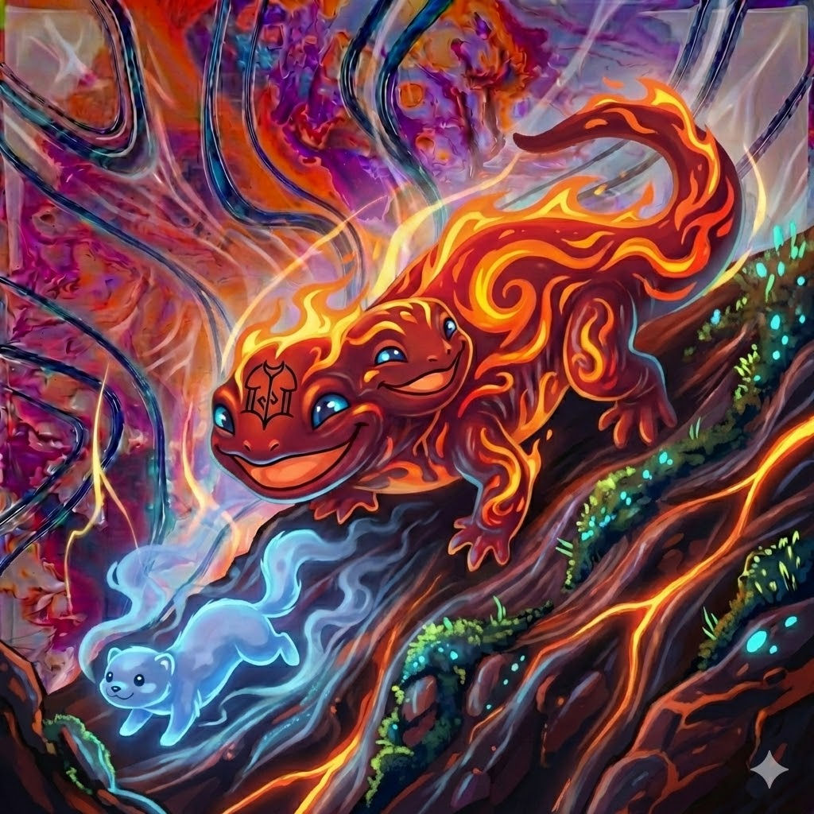

# Salamander - Plugin Manager for CarThing



A desktop raylib application for installing and uninstalling llizardgui-host plugins on a CarThing device, featuring a fire salamander visual theme.

## Features

- Browse local and device-installed plugins
- Install plugins to CarThing via SCP
- Uninstall plugins from CarThing via SSH
- Fire-themed UI with animated ember glow effects
- Real-time connection status monitoring
- Smooth scrolling and selection animations

## Prerequisites

- `sshpass` installed: `sudo apt install sshpass`
- CarThing connected via USB at `172.16.42.2`
- ARM plugins built in `build-armv7-drm/`

## Building

```bash
cd supporting_projects/salamander
mkdir build && cd build
cmake ..
make -j$(nproc)
```

## Running

```bash
# From build directory (uses default plugin path)
./salamander

# Or specify custom local plugin path
./salamander /path/to/armv7/plugins
```

Default local plugin path: `../../build-armv7-drm` (relative to build directory)

## Usage

### Keyboard Controls

| Key | Action |
|-----|--------|
| Up/Down | Navigate plugin list |
| Tab | Switch between Local/Device view |
| Enter | Install selected plugin |
| Delete/Backspace | Uninstall selected plugin |
| R | Refresh plugin lists |
| Escape | Close application |

### Mouse

- Click INSTALL button to install selected plugin
- Click UNINSTALL button to remove selected plugin

## Connection Settings

Default CarThing connection:
- Host: `172.16.42.2`
- User: `root`
- Password: `llizardos`
- Plugin path: `/usr/lib/llizard/plugins`

## File Structure

```
salamander/
├── CMakeLists.txt          # Build configuration
├── README.md               # This file
└── src/
    ├── main.c              # Entry point and UI
    ├── salamander_theme.h  # Fire color palette
    ├── ssh_manager.h/c     # SSH/SCP operations
    └── plugin_browser.h/c  # Plugin discovery
```

## Color Theme

Fire salamander palette:
- **Fire Deep** `#E5420B` - Primary accent
- **Ember** `#F5A623` - Warm glow
- **Gold** `#FFC850` - Highlights
- **Charcoal Dark** `#1A1A1A` - Background
- **Warm Gray** `#2A2426` - Cards

## Troubleshooting

### "Device not connected"
1. Ensure CarThing is connected via USB
2. Check that `172.16.42.2` is reachable: `ping 172.16.42.2`
3. Verify sshpass is installed: `which sshpass`

### No plugins shown
1. Build ARM plugins first: `cd build-armv7-drm && make`
2. Verify plugins exist: `ls ../../build-armv7-drm/*.so`
3. Press R to refresh

### Install fails
1. Check device has space: `ssh root@172.16.42.2 'df -h'`
2. Ensure `/usr/lib/llizard/plugins` directory exists
3. Check for permission errors in terminal output
